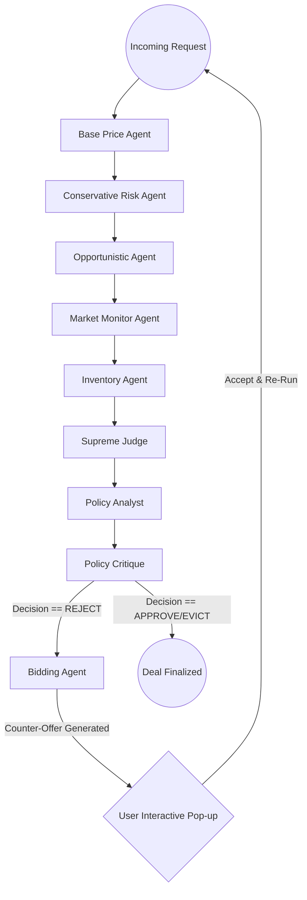

# GPU Pricing Agent: System Design Document

## 1. Executive Summary & The Story
The **GPU Pricing Agent** is not just a calculator—it is an **Agentic AI Deal Desk**. In the high-stakes world of GPU leasing (H100, A100, B200), pricing is often a "black box" where revenue is lost due to rigid rules or missed market opportunities.

This application tells a story of **"Glass-Box Transparency."** It transforms complex financial decisions into a clear, narrated journey. For every incoming request, a committee of specialized "Agents" debates the merits of the deal in real-time. This allows stakeholders (and students) to see exactly *why* a price was surged, why a deal was rejected, or why an existing customer was evicted to make room for a higher-paying one.

---

## 2. The Story: "Life of a Deal"
Imagine an incoming request for **8x H100 GPUs** for a **24-hour training run**. Here is the journey that deal takes through our "Deal Desk":

1.  **The Floor**: The **Base Price Agent** calculates the raw cost of electricity and hardware wear-and-tear to ensure we never lose money.
2.  **The Debate**: 
    - The **Conservative Agent** warns about margin erosion and low-priority users.
    - The **Opportunistic Agent** looks at the remaining 30% of our fleet and suggests a "scarcity premium" to win more revenue.
    - The **Market Monitor** checks if Azure or AWS is cheaper right now to ensure we remain competitive.
3.  **The Verdict**: The **Supreme Judge** weighs these conflicting "thoughts" and issues a final Decision: **APPROVE**, **OVERRIDE**, or **REJECT**.
4.  **The Post-Mortem (Learning Phase)**: 
    - The **Policy Analyst** immediately runs a "What-if" scenario (e.g., "What if our margin floor was 5% lower?").
    - The **Policy Critique** analyzes the analyst's findings and suggests specific, actionable policy tweaks (e.g., "Decrease `min_margin` to 10% to win more volume").
5.  **The Negotiation (Interactive Loop)**: If the deal is rejected, the **Bidding Agent** steps in. It generates a counter-offer ("We can't do $1.50, but we can do $1.85").
6.  **The Human in the Loop**: The stakeholder (user) sees this counter-offer and can click **"Accept & Re-Run"** to finalize the deal, creating a dynamic, interactive negotiation loop.

---

## 3. The Multi-Agent Ecosystem (The Personalities)
To make the decision-making process intuitive, each agent has a specific "voice" and mandate:

| Agent | Persona | Strategic Value |
| :--- | :--- | :--- |
| **Base Price** | *The Accountant* | Ensures CapEx/OpEx recovery and baseline margins. |
| **Conservative** | *The Risk Manager* | Protects against price dumping and low-margin churn. |
| **Opportunistic** | *The Revenue Optimizer* | Capitalizes on scarcity and hardware ROI lifecycle. |
| **Market Monitor** | *The Competitive Intel* | Prevents us from pricing ourselves out of the market. |
| **Inventory Alpha** | *The Fleet Admiral* | Dictates when to expand (Buy) or contract (Sell) the fleet. |
| **Supreme Judge** | *The Executive* | Reconciles conflicting advice into a single "Action." |
| **Policy Analyst** | *The Strategist* | Performs sensitivity analysis on "What-if" scenarios. |
| **Policy Critique** | *The Advisor* | Recommends specific tuning tweaks for the 6 core policies. |
| **Bidding Agent** | *The Negotiator* | Saves lost revenue by proposing acceptable counter-offers. |

---

## 4. Hierarchy & Operational Workflow
The workflow captures the full lifecycle of a deal, from raw input to post-mortem analysis.

---

---

## 5. Strategic Governance & Technical Enforcement
While the agents use natural language to "think," they are strictly governed by the 6 policy thresholds (Dials) set in the UI. These are passed into the AI's context for every deal.

### Policy A: Margin Floor Protection (The Absolute Minimum)
- **Agent Directive**: Enforced by the **Conservative Agent**.
- **Logic**: `IF Proposed_Quote < (Depreciation + OPEX + Min_Margin), THEN Action = OVERRIDE to Floor`.
- **Stakeholder Value**: Guarantees we never lease at a loss.

### Policy B: Scarcity-Driven Yield (Surge Pricing)
- **Agent Directive**: Enforced by the **Inventory Alpha Agent**.
- **Logic**: `IF Fleet_Availability < Scarcity_Threshold, THEN Final_Price = Base * Scarcity_Multiplier`.
- **Stakeholder Value**: Maximizes revenue during periods of high demand.

### Policy C: Strategic Preemption (The Eviction Engine)
- **Agent Directive**: Enforced by the **Supreme Judge Agent**.
- **Logic**: `IF (On_Demand_Bid - Current_Spot_Rate) > Eviction_Delta, THEN Action = EVICT Spot Instance`.
- **Stakeholder Value**: Reclaims hardware for premium customers while maintaining the **Trust Score**.

### Policy D: Lifecycle Aggression (Cost Recovery)
- **Agent Directive**: Enforced by the **Opportunistic Agent**.
- **Logic**: `IF GPU.Cost_Recovered == TRUE, THEN bypass Margin Floor for Spot requests to guarantee 100% utilization`.
- **Stakeholder Value**: Monetizes hardware that has already achieved its full ROI.

### Policy E: Market Pulse (Competitive Ceiling)
- **Agent Directive**: Enforced by the **Market Monitor Agent**.
- **Logic**: `IF Proposed_Price > (Competitor_Price * (1 + Max_Premium)), THEN Action = OVERRIDE to Ceiling`.
- **Stakeholder Value**: Prevents brand damage from excessive surge pricing.

---

## 6. How it Works: The "Context Injection"
The adherence is not just "suggested"—it is technically enforced through **Context Injection**. 
1. The **Chaos Monkey Simulator** pulls the sliders from the DB.
2. It injects them into the `AgenticState` under `policy_thresholds`.
3. The **LLM System Prompts** are explicitly anchored to these values (e.g., *"Focus on min_margin," "Check the max_market_premium policy"*).
4. The **Supreme Judge** is forced to summarize the "Pros/Cons" relative to these specific financial triggers before reaching a verdict.

---

## 7. Real-Time Business Intelligence
The application provides a "Command Center" view of the fleet's health:
- **Revenue & ROI**: Tracks progress toward recovering the initial **$250,000** cluster investment.
- **Trust Score**: A long-term metric that balances aggressive profit-seeking with customer stability.
- **Glass-Box Explanations**: Every single decision is accompanied by a natural language "receipt" explaining the math and the strategy behind the price.

